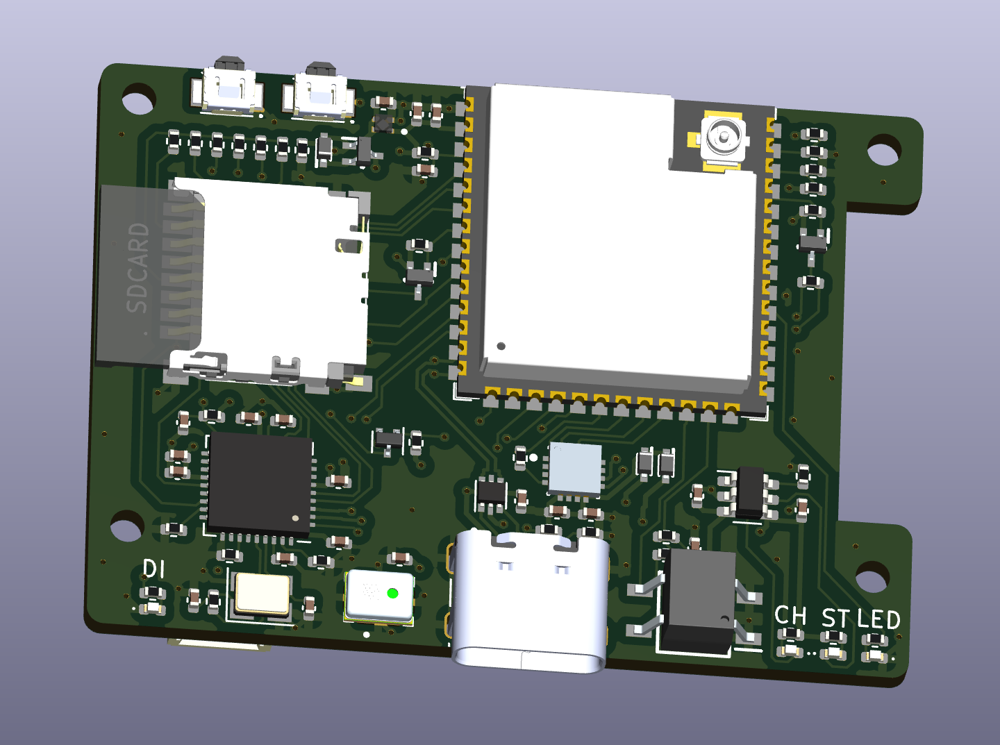

# WIP - ESP32-TV Hardware Files

This is Work In Progress - I'm still working on this.

This repo contains/will contain the hardware design files for the ESP32-TV project.

## Schematic

You can either open this up in KiCad, or there's a PDF [here](./images/micro-esp32-s3.pdf).

.

## PCB

Open this up in KiCad to export the Gerber files.

## What's this all about?

More details to follow...

